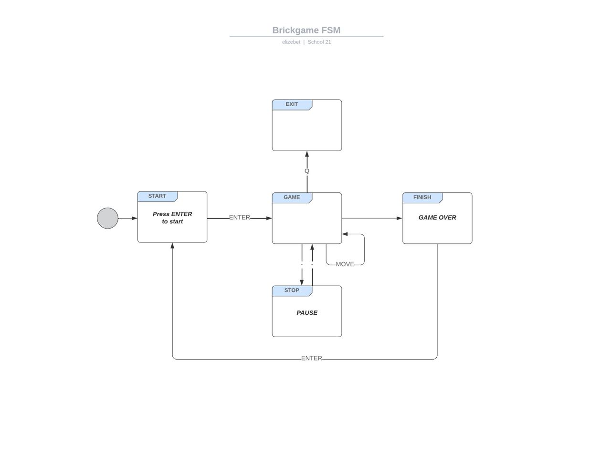

Визуальная часть разработана с помощью библиотеки ncurses. Игровое поле соответствует размерам игровой матрицы поля - десять «пикселей» в ширину и двадцать «пикселей» в высоту.

Для управления используются следующие кнопоки:
    'ENTER' - Начало игры,
    ' ' - Пауза,
    'q' или 'Q' - Завершение игры,
    Стрелка влево — движение фигуры влево,
    Стрелка вправо — движение фигуры вправо,
    Стрелка вниз — ускорение падения фигуры,
    Стрелка вверх - вращение фигуры.

Конечный автомат
КА состоит из следующих состояний:
    START - состояние, в котором игра ждет, пока игрок нажмет кнопку готовности к игре (Enter).
    GAME -  игровое действие, где создается фигура, пользователь может ее перемещать, также происходит подсчет очков и изменение уровня и скорости.
    PAUSE - осостояние паузы, вызываетс нажатием клавиши ПРОБЕЛ
    GAME_OVER - состояние, при котором не возможно появление следующей фигуры. Состояние переходит в START
    EXIT - Если игрок нажимает на кнопку 'q' или 'Q', то игра завершается.

